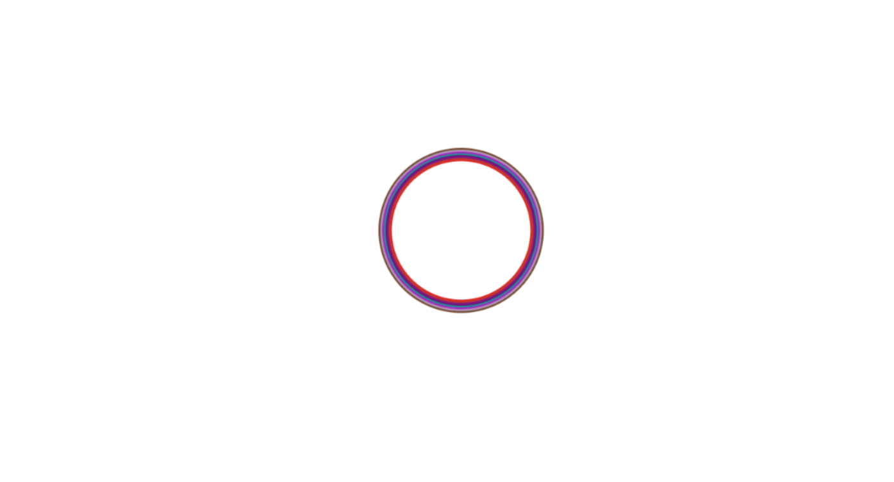

## [Published blog link](https://comfy-peony-64d99b.netlify.app/ "Click the link")
----

[](https://comfy-peony-64d99b.netlify.app/)

**Goal** - 
    A page where i can click it genrates a circle that animates with scalling the size and simultanously changing its border color.

**Overview** - 
    So basically i added a click event listner so that i can listen to clicks and get their coordinates. Then i created a function to genrate random colors ofor the circle. After this i new element and attached circle class to it so that i can give a shape to the element and then i added some animations to it.


**Step by step guide** - 

1. Firstly I created a style or base on which i can animate name "Circle" in css
```CSS
.circle {
    opacity: 0;
    height: 100px;
    width: 100px;
    position: absolute;
    border-radius: 100%;
    border: 2px solid black;
    }
```

2. Create a new `div` element 
```JavaScript
const newDiv = document.createElement("div");
```

3. Add class to the newly created div so that we can apply basic styles to it like its shape and size.
```JavaScript
newDiv.classList.add("circle");
```
4. Giving the positions the circle. ``${e.clientY - 50}px``, So that the circle gets aligned to the mouse clicked point.
```JavaScript
      newDiv.style.top = `${e.clientY - 50}px`;
      newDiv.style.left = `${e.clientX - 50}px`;
```
5. Here i used a property `animate` chained to the div. In this keyframe format the elements inside the css property array of all properties gets evenly spaced out and  the syntax goes the following
```JavaScript
Element.animate(
    {
        CSS Property: [value, value]
    }
)
```

```JavaScript
newDiv.animate(
  {
    borderColor: [
      randomColorGenerator(),
      randomColorGenerator(),
      randomColorGenerator(),
      randomColorGenerator(),
      randomColorGenerator(),
    ],
    scale: [1, 1.35, 1.65, 1.8, 2],
    opacity: [1, 1, 1, 1, 1, 1],
  },
  3000
);
```
5. The last step which was to append the `newDiv` to the body.
```JavaScript
body.appendChild(newDiv);
```


**P.S**- And that's how i made this project come to life.